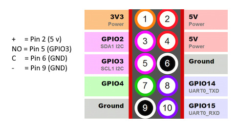

**<h1>Create Led Shutdown Switch</h1>** <br>
**<h3>This power switch will shutdown the Pi safely so that you don’t have</h3>** <br>
**<h3>to worry about corrupting your SD card and file system,</h3>** <br>
**<h3>which can happen if you just disconnect the power abruptly.</h3>** <br>

- **Add config device tree overlays** <br>
```sudo nano /boot/config.txt```

- **Insert this to the bottom** <br>
```dtoverlay=gpio-shutdown,gpio_pin=3,active_low=1,gpio_pull=up```

- **Create file** <br> 
     sudo nano /etc/udev/rules.d/99-gpio-power.rules

- **And insert this** <br>
```ACTION!="REMOVE", SUBSYSTEM=="input", KERNEL=="event*", \``` <br> 
   ```SUBSYSTEMS=="platform", DRIVERS=="gpio-keys", \``` <br> 
   ```ATTRS{keys}=="116", TAG+="power-switch"``` <br>

- **And restart raspberry pi.** <br>

**<h3>I2C must be deactivated if you use GPIO3 (Pin 5)</h3>** <br> 


